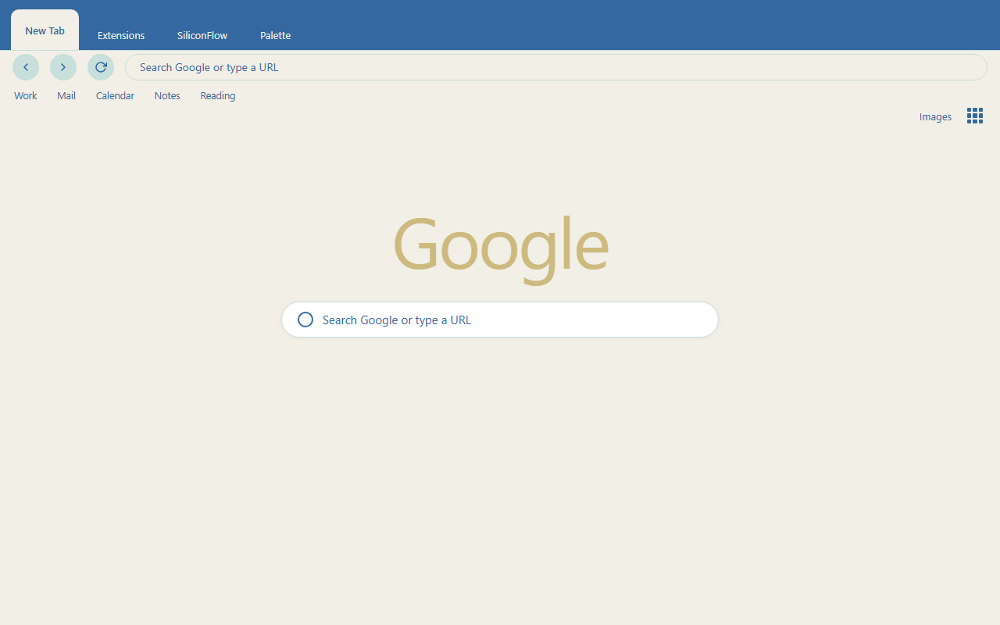

  

<h1 align="center">Ocean Mist Theme</h1>

  A calm, minimalist coastal theme for Google Chrome.

  
  
  

## About

Ocean Mist Theme brings the quiet feeling of a morning coastline into your browser. It uses a carefully balanced palette of deep ocean blue, soft sky blue, mist cyan, and warm white to create a clean, premium, and comfortable workspace.

No gradients, no textures, no illustrations, no clutter — just solid colors that help you focus.

## Color Palette

| Token | Hex | Usage |
|-------|-----|-------|
| Deep Ocean Blue | `#3368A0` | Browser frame, dark backgrounds |
| Soft Sky Blue | `#66A3BF` | Inactive tabs, accents |
| Mist Cyan | `#C8DFDB` | Bookmark bar, highlights |
| Warm White | `#F2EFE7` | Toolbar, active tab, background |

## Features

- Solid color design with no images or gradients for a lightweight, distraction-free look.
- Carefully tuned contrast for readable tabs, toolbar, and omnibox text.
- Soft, cool palette inspired by the calm of an early coastal morning.
- Works with both light and dark system UI without extra configuration.

## Install

### From source (unpacked)

1. Download or clone this repository.
2. Open Chrome and navigate to `chrome://extensions`.
3. Enable **Developer mode** in the top-right corner.
4. Click **Load unpacked** and select this folder.

### From Chrome Web Store

Search for **Ocean Mist Theme** in the Chrome Web Store and click **Add to Chrome**.

## Preview

## License

Non-Commercial License — free for personal use. Commercial use is not permitted without permission.
